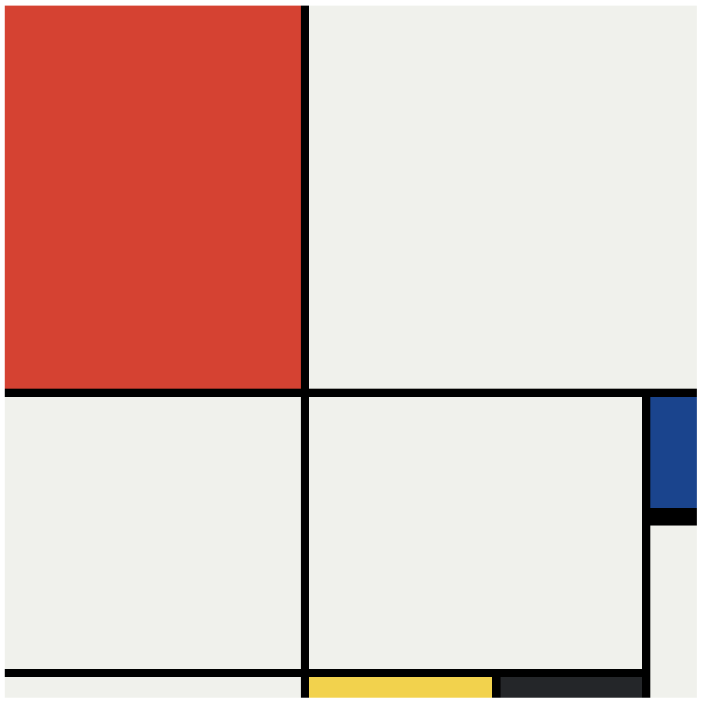

## CSS Mondrian Painting
### About This Project
This is a Piet Mondrian painting practice, created with CSS Grid for the layout structure and Flexbox for centring the artwork.

### Tech Used
- CSS3 - Grid, Flexbox
- HTML5

### Screenshot

